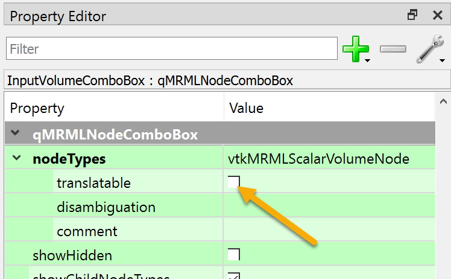

# Guide for Slicer module developers

These instructions are for Slicer module developers (in Slicer core or in Slicer extensions) who want to make their modules to be translatable.

## Preparing .ui files for translation

By default, most string and stringlist properties that appear in .ui files are made avaiable for translation. This is usually the correct behavior, but in some cases strings contain strings that must not be translated and must not appear in translation source (.ts) files.

Properties that **must be marked as non-translatable in Qt designer** by unchecking the `Translatable` option, unless they are set to their default value (typically empty):

- In node selector widgets, such as qMRMLNodeComboBox, qMRMLCheckableNodeComboBox, qMRMLSubjectHierarchyTreeView, qMRMLTreeView:
  - `nodeTypes`
  - `hideChildNodeTypes`
  - `interactionNodeSingletonTag` (if not the default "Singleton" value)
  - `sceneModelType`
  - `levelFilter`
- In MRML widgets (qMRML...Widget) that support quantities, such as qMRMLRangeWidget or qMRMLCoordinatesWidget:
  - `quantity`
- In widgets that save data into application settings, such as ctkPathLineEdit, qMRMLSegmentationFileExportWidget, qMRMLSegmentEditorWidget:
  - `settingKey`
  - `defaultTerminologyEntrySettingsKey`
- In widgets that save data into node or subject hierarchy attributes, such as qMRMLSubjectHierarchyComboBox, SubjectHierarchyTreeView:
  - `includeItemAttributeNamesFilter`
  - `excludeItemAttributeNamesFilter`
  - `includeNodeAttributeNamesFilter`
  - `excludeNodeAttributeNamesFilter`
- In slice view widgets, such as qMRMLSliceControllerWidget and qMRMLSliceWidget:
  - `sliceViewName`
  - `sliceOrientation`
- In qMRMLSegmentationConversionParametersWidget:
  - `targetRepresentationName`
- In qSlicerMouseModeToolBar:
  - `defaultPlaceClassName`

